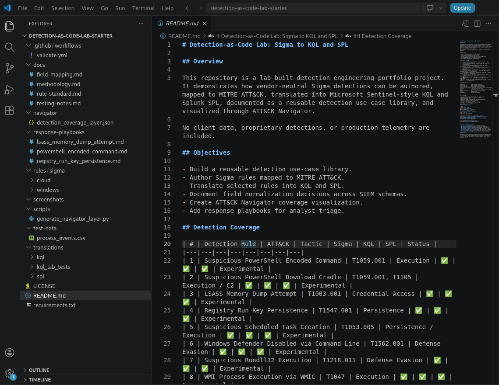
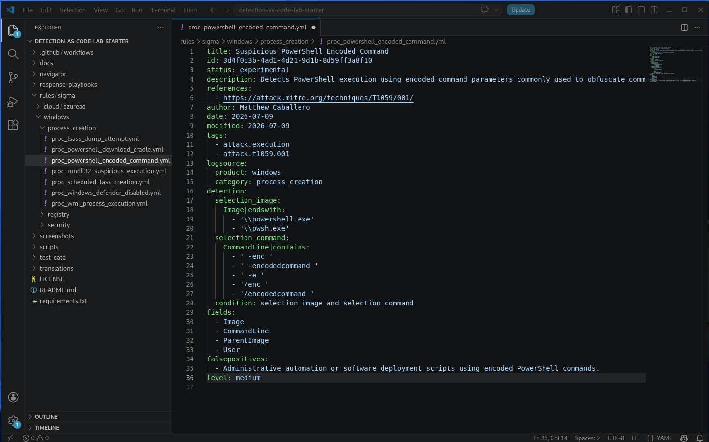
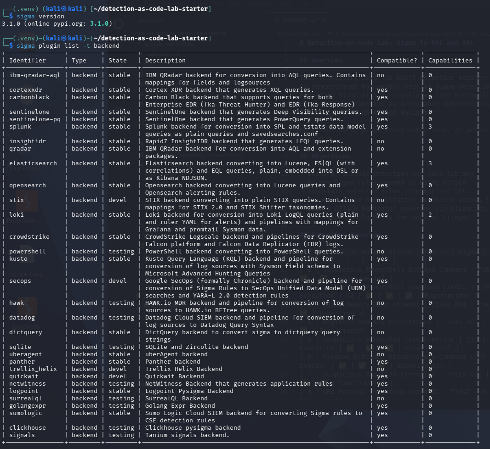
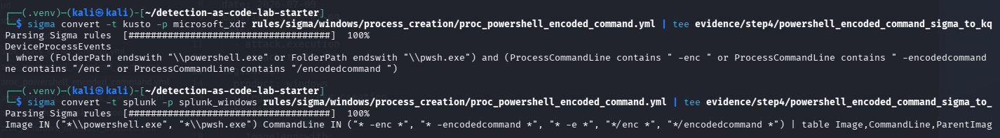
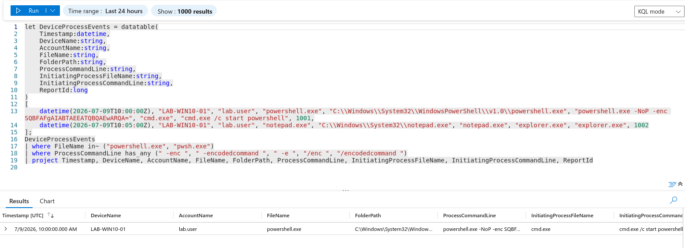
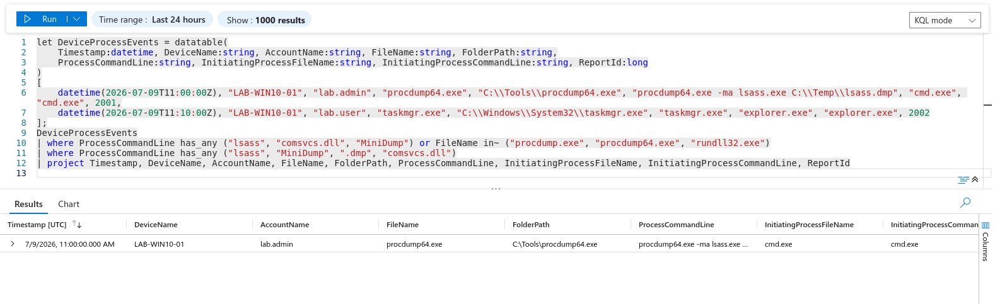
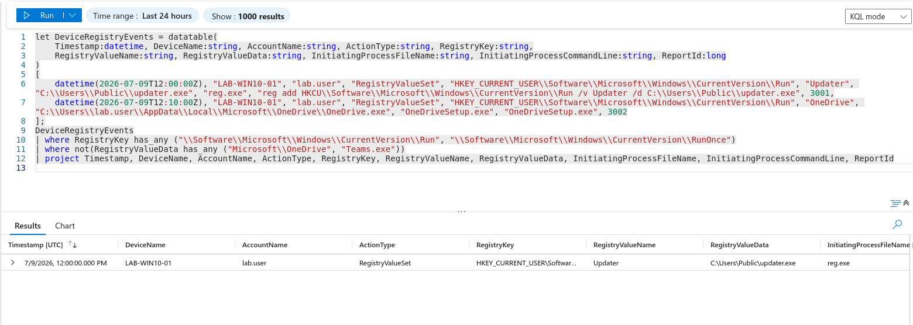
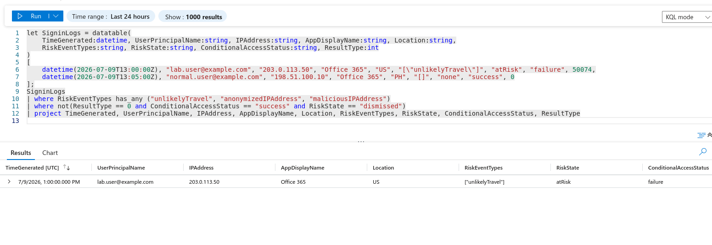

# Detection-as-Code Lab
### Multi-SIEM Detection Engineering — Sigma → KQL & SPL, mapped to MITRE ATT&CK


> A lab-built **detection-as-code** library: 10 attacker techniques authored as vendor-neutral **Sigma** rules, translated into **Microsoft Sentinel KQL** and **Splunk SPL**, validated against **synthetic telemetry**, mapped to **MITRE ATT&CK**, and visualized as a coverage map — with an analyst **response playbook** for every rule.

> [!IMPORTANT]
> **Disclaimer.** This project uses **lab-authored detections and synthetic telemetry only**. It contains **no client data, no proprietary detections, no production telemetry, and no confidential work artifacts**. It reproduces a detection-engineering *capability* in a controlled environment so the entire workflow can be shared openly and safely.

---

## Why I built this

In my day-to-day work I build and migrate detection content across Microsoft Sentinel, Splunk, and CrowdStrike for client engagements I can't disclose. This repository reproduces that capability **from scratch, in my own lab**, so the full workflow — from authoring a rule to validating it — is transparent and verifiable, without a single line of confidential data.

The design principle is **detection-as-code**: detections are treated like software. A vendor-neutral Sigma rule is the single source of truth, everything downstream (KQL, SPL, tests, ATT&CK coverage) derives from it, and the whole thing is version-controlled in Git. This is how a modern detection team keeps content consistent, portable across SIEMs, and testable.

## What this project demonstrates

- **Detection-as-code workflow** — Sigma as one version-controlled source of truth
- **Multi-SIEM translation** — the same detection expressed in Sentinel **KQL** and Splunk **SPL**
- **MITRE ATT&CK mapping** — every rule tagged to a technique, with a Navigator coverage layer
- **Synthetic validation** — detections tested with in-query data, **no real logs required**
- **Schema normalization** — deliberate field mapping across Sigma / KQL / Splunk data models
- **Analyst enablement** — a triage/response playbook for each detection

**Topics:** `detection-engineering` · `sigma` · `kql` · `spl` · `mitre-attack` · `siem` · `threat-detection` · `detection-as-code`

## Detection coverage

| # | Detection Rule | ATT&CK | Tactic | Sigma | KQL | SPL | Status |
| :-: | :--- | :--- | :--- | :-: | :-: | :-: | :--- |
| 1 | Suspicious PowerShell Encoded Command | T1059.001 | Execution | ✅ | ✅ | ✅ | Experimental |
| 2 | PowerShell Download Cradle | T1059.001, T1105 | Execution / C2 | ✅ | ✅ | ✅ | Experimental |
| 3 | LSASS Memory Dump Attempt | T1003.001 | Credential Access | ✅ | ✅ | ✅ | Experimental |
| 4 | Registry Run Key Persistence | T1547.001 | Persistence | ✅ | ✅ | ✅ | Experimental |
| 5 | Suspicious Scheduled Task Creation | T1053.005 | Execution / Persistence | ✅ | ✅ | ✅ | Experimental |
| 6 | Windows Defender Disabled via CLI | T1562.001 | Defense Evasion | ✅ | ✅ | ✅ | Experimental |
| 7 | Suspicious Rundll32 Execution | T1218.011 | Defense Evasion | ✅ | ✅ | ✅ | Experimental |
| 8 | WMI Process Execution | T1047 | Execution | ✅ | ✅ | ✅ | Experimental |
| 9 | SMB Admin Share Access | T1021.002 | Lateral Movement | ✅ | ✅ | ✅ | Experimental |
| 10 | Azure AD Risky Sign-In / Unlikely Travel | T1078 | Initial Access / Valid Accounts | ✅ | ✅ | ✅ | Experimental |

## How it's organized

```text
detection-as-code-lab/
├── rules/sigma/            # canonical vendor-neutral detections (source of truth)
├── translations/
│   ├── kql/                # hand-reviewed Microsoft Sentinel KQL
│   ├── spl/                # hand-reviewed Splunk SPL
│   └── kql_lab_tests/      # synthetic datatable() validation queries
├── navigator/              # MITRE ATT&CK Navigator coverage layer (JSON)
├── response-playbooks/     # analyst triage / response runbook per detection
├── docs/                   # methodology, field mapping, rule standard, testing notes
├── screenshots/            # evidence
└── evidence/               # saved sigma-cli conversion output
```



---

## Walkthrough

The same six-step pipeline produces every detection in the library. Here it is end to end, using the **PowerShell Encoded Command** detection as the worked example.

### Step 1 — Author the detection in Sigma

Each detection starts as a [Sigma](https://github.com/SigmaHQ/sigma) rule: vendor-neutral YAML that describes the logic once, independent of any SIEM. Writing in Sigma first forces the detection *intent* to be explicit before it's entangled in any one query language. Every rule follows the [rule standard](docs/rule-standard.md) — title, stable `id`, description, ATT&CK `tags`, `logsource`, detection logic, documented false positives, and severity.

The example rule detects PowerShell launched with an encoded-command flag (`-enc`, `-encodedcommand`, `-e`, `/enc`), a common way to obscure a malicious payload — mapped to **T1059.001**.



The toolchain is the [Sigma CLI](https://github.com/SigmaHQ/sigma-cli), installed in a Python virtual environment along with the KQL and Splunk backends.



### Step 2 — Convert to KQL and SPL with Sigma CLI

With the backends installed, one Sigma rule converts to multiple SIEM query languages — proving the detection is **portable**:

```bash
# Microsoft Sentinel / XDR (KQL)
sigma convert -t kusto -p microsoft_xdr \
  rules/sigma/windows/process_creation/proc_powershell_encoded_command.yml

# Splunk (SPL)
sigma convert -t splunk -p splunk_windows \
  rules/sigma/windows/process_creation/proc_powershell_encoded_command.yml
```



**A real lesson from this step:** the Splunk backend requires a **processing pipeline** that matches the target log-source model. Running the conversion without one errors out, and `-p sysmon` fails because that isn't the installed pipeline's name — the working pipeline is `splunk_windows`. That's not a rule failure; it's the practical reality of aligning detection logic to a target schema, and it's exactly the kind of thing that separates "ran a converter" from "understands SIEM data models."

### Step 3 — Hand-review the translations

Auto-conversion proves portability; **hand-review proves engineering judgment.** The refined queries in [`translations/`](translations/) improve on the raw output with deliberate field selection for each platform's data model, projected analyst-triage fields (host, user, parent process, command line), and realistic data-source assumptions. The full field-mapping reference across Sigma, KQL, and Splunk lives in [`docs/field-mapping.md`](docs/field-mapping.md).

### Step 4 — Validate with synthetic telemetry

Detections are tested **without any real logs** using KQL `datatable()` blocks that build fake-but-realistic events inside the query itself. Each test includes a **malicious** row (should match) and a **benign control** row (should be filtered out), so it proves the logic *discriminates* rather than just returning rows. Tests run in **Azure Log Analytics → Logs**; because the data is generated in-query, the workspace time range is irrelevant and no connectors, agents, or ingestion are needed.

Four detections shown validating across four different tactics:

| PowerShell Encoded Command (Execution) | LSASS Dump Attempt (Credential Access) |
| :---: | :---: |
|  |  |
| **Registry Run Key (Persistence)** | **Azure AD Risky Sign-In (Initial Access)** |
|  |  |

Expected result counts for all ten tests are documented in [`docs/testing-notes.md`](docs/testing-notes.md).

### Step 5 — Map and visualize coverage in ATT&CK Navigator

Every rule is tagged with its ATT&CK technique, and [`navigator/detection_coverage_layer.json`](navigator/detection_coverage_layer.json) renders those techniques as a coverage layer in the [ATT&CK Navigator](https://mitre-attack.github.io/attack-navigator/). Scores and comments tie the coloring to specific detections, so the map reflects real coverage rather than decoration.

<!-- VERIFY these two filenames against `ls screenshots/` and fix if needed. -->


The library covers **10 techniques across 6 tactics** — Execution, Credential Access, Persistence, Defense Evasion, Lateral Movement, and Initial Access:

`T1059.001` · `T1105` · `T1003.001` · `T1547.001` · `T1053.005` · `T1562.001` · `T1218.011` · `T1047` · `T1021.002` · `T1078`

Drilling into a technique shows the coverage is detection-backed, not just colored in:


### Step 6 — Document the analyst response

A detection is only half the job — an analyst has to act on the alert. Every rule has a matching runbook in [`response-playbooks/`](response-playbooks/) covering detection intent, triage steps, enrichment fields, false positives, escalation criteria, and containment actions — the same thinking that underpins a SOAR playbook. See, for example, the [PowerShell Encoded Command playbook](response-playbooks/powershell_encoded_command.md).

---

## Recreate it yourself

Everything here is reproducible with free tooling and a Log Analytics workspace.

**1. Set up the Sigma toolchain**

```bash
python -m venv .venv && source .venv/bin/activate     # Windows: .venv\Scripts\activate
pip install -r requirements.txt
sigma plugin list -t backend        # confirm kusto + splunk backends
```

**2. Convert a rule to KQL and SPL** (see Step 2 above). Remember the Splunk pipeline: use `-p splunk_windows`.

**3. Validate a detection with no real data.** Open any file in [`translations/kql_lab_tests/`](translations/kql_lab_tests/) in **Azure Log Analytics → Logs** and run it. The `datatable()` block generates the events inside the query, so the time range doesn't matter. Compare the returned rows against the expected counts in [`docs/testing-notes.md`](docs/testing-notes.md).

**4. Explore coverage.** Import [`navigator/detection_coverage_layer.json`](navigator/detection_coverage_layer.json) into the [ATT&CK Navigator](https://mitre-attack.github.io/attack-navigator/).

> 💡 **Cost note:** this project needs only a Log Analytics workspace and the KQL editor — no data connectors, agents, or ingestion. Set a daily cap and a budget alert, and delete the resource group when finished, so it stays effectively free.

## Documentation

| Doc | What's inside |
| :--- | :--- |
| [`docs/methodology.md`](docs/methodology.md) | The full authoring → conversion → validation → coverage workflow and design decisions |
| [`docs/field-mapping.md`](docs/field-mapping.md) | Schema normalization across Sigma / KQL / Splunk field models |
| [`docs/rule-standard.md`](docs/rule-standard.md) | The metadata and quality bar every rule must meet |
| [`docs/testing-notes.md`](docs/testing-notes.md) | Synthetic testing method and expected result counts per rule |

## Roadmap — Piece 2

- Live telemetry: Windows + **Sysmon** shipping into **Microsoft Sentinel**
- **Sentinel analytics rules** deployed from these detections, firing against **Atomic Red Team** tests
- **SOAR** enrichment/response via **Logic Apps**
- **Splunk** runtime validation (Splunk Free, local, synthetic event)

## About

Built by **Matthew Caballero** — cybersecurity consultant specializing in detection engineering and offensive security (PNPT; CPTS & BSCP in progress).

🔗 [LinkedIn](https://www.linkedin.com/in/matthewgcaballero) · [Verify certifications](https://www.credly.com/users/matthew-caballero.9d29c5b1)
